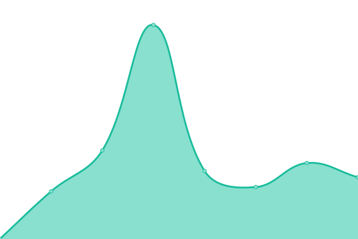

# [📈 Live Status](https://status.isitzoe.dev): <!--live status--> **🟩 All systems operational**

This repo has the uptime monitor and status page for all my public services.

The status page is powered entirely by a GitHub repository. It uses [Issues](https://github.com/justdanielndev/uptime/issues) as incident reports, [Actions](https://github.com/justdanielndev/uptime/actions) as uptime monitors, and [Pages](https://status.isitzoe.dev) for the status page itself.

<!--start: status pages-->
<!-- This summary is generated by Upptime (https://github.com/upptime/upptime) -->
<!-- Do not edit this manually, your changes will be overwritten -->
<!-- prettier-ignore -->
| URL | Status | History | Response Time | Uptime |
| --- | ------ | ------- | ------------- | ------ |
|  [Portfolio](https://zoe.rocks) | 🟩 Up | [portfolio.yml](https://github.com/justdanielndev/uptime/commits/HEAD/history/portfolio.yml) | 

 246ms
     
 | 

<a href="https://status.isitzoe.dev/history/portfolio">100.00%</a>
    

|  [CDN](https://cdn.isitzoe.dev) | 🟩 Up | [cdn.yml](https://github.com/justdanielndev/uptime/commits/HEAD/history/cdn.yml) | 

 283ms
     
 | 

<a href="https://status.isitzoe.dev/history/cdn">100.00%</a>
    

|  [Hack Club Wrapped](https://wrapped.isitzoe.dev) | 🟩 Up | [hack-club-wrapped.yml](https://github.com/justdanielndev/uptime/commits/HEAD/history/hack-club-wrapped.yml) | 

 488ms
     
 | 

<a href="https://status.isitzoe.dev/history/hack-club-wrapped">100.00%</a>
    

|  [Nix Entertainment Homepage](https://nixentertainment.com) | 🟩 Up | [nix-entertainment-homepage.yml](https://github.com/justdanielndev/uptime/commits/HEAD/history/nix-entertainment-homepage.yml) | 

 205ms
     
 | 

<a href="https://status.isitzoe.dev/history/nix-entertainment-homepage">100.00%</a>
    

|  [Nix Entertainment Forms](https://forms.nixentertainment.com) | 🟩 Up | [nix-entertainment-forms.yml](https://github.com/justdanielndev/uptime/commits/HEAD/history/nix-entertainment-forms.yml) | 

 320ms
     
 | 

<a href="https://status.isitzoe.dev/history/nix-entertainment-forms">100.00%</a>
    

<!--end: status pages-->

[**Visit the status website →**](https://status.isitzoe.dev)
